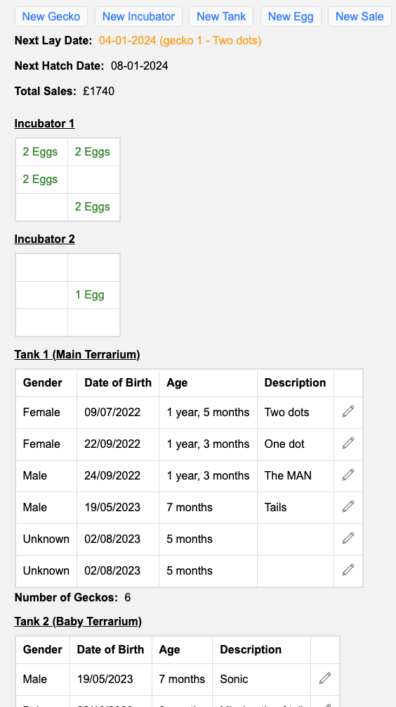

# gecko-tracker
Used to track my geckos + egg laying + hatching

<br>
<br>
<br>
<br>
<br>

# port

Runs on port `8080`

# env variables

Supports saving data to couchdb, required variables are:-

```
DATABASE_URL="https://my.couchdb.url/"
DATABASE_USERNAME="my-couchdb-username"
DATABASE_PASSWORD="my-couchdb-password"
DATABASE_NAME="eggs"
```

## option to override default sale sources:-

Default = `Facebook,Preloved`

```
SALE_SOURCES="Facebook,eBay"
```

## set custom hatch days

Default = `60d`

```
export HATCH_DAYS="2d"
```